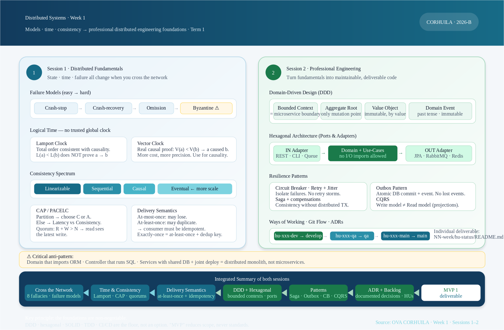

<!-- HU-STATUS TEMPLATE - do NOT remove the <!-- ... --> markers or the table headers.
     Your weekly grade is read AUTOMATICALLY from this file:
       01-week/hu-status/README.md  (inside YOUR fork). English. -->

# Weekly Status - Week 01

<!-- CONFIG-START - must match your profile repo (username/username) CONFIG -->
- FULL_NAME: Bairon Alexander Suarez Camacho
- GITHUB_USER: BackSua
- TEAM: The Illusionists - PRJ-OPTIVIEW
- SPRINT_GOAL: Turn the OptiView optical-store brief into a Patients bounded context map, a product brief for ms-pacientes, an ADR for the microservices architectural style, and a testable backlog of patient-registration and optical-formula user stories.
<!-- CONFIG-END -->

## 1. User stories worked this week

| HU ID | Title | Status (todo/doing/done) | Evidence (PR or commit URL) |
|---|---|---|---|
| HU-OPT-001 | Write the product brief (prd.md) for the Patients bounded context | done | https://github.com/BackSua/sistemas-distribuidos-2026-b-g1/commit/c83b050 |
| HU-OPT-002 | Define bounded context map and ubiquitous language for ms-pacientes | done | https://github.com/BackSua/sistemas-distribuidos-2026-b-g1/commit/c83b050 |
| HU-OPT-003 | Design hexagonal architecture skeleton for ms-pacientes (ports, adapters, domain entities) | doing | Branch hu-opt-003-dev not yet merged |
| HU-OPT-004 | Write ADR-001: microservices vs. modular monolith architectural decision | todo | Pending — branch hu-opt-004-dev not opened yet |

## 2. My individual contribution

- Wrote the product brief (`prd.md`) for the Patients bounded context of OptiView: initial context, needs and problems, current process, open questions and business glossary (Patient, OpticalFormula, PupillaryDistance, PeriodicControl, domain events). Defined the scope explicitly — `ms-pacientes` owns clinical records only; it does not persist orders, inventory or billing data.
- Defined the **bounded context map for ms-pacientes**: identified the Aggregate Root (`Patient`), the Value Objects (`OpticalFormula` with full OD/OI parameters, `PupillaryDistance`), the Entities (`PeriodicControl`) and the Domain Events (`PatientRegistered`, `FormulaAdded`, `PeriodicControlExpired`). Every term has a precise entry in the ubiquitous language so the whole team shares one vocabulary with no ambiguity.
- Applied the Week-1 session material: drafted the **context map first** — confirming that Patients, Inventory, Orders and Billing are four real bounded contexts with different business rules, different teams and different deployment needs — before proposing any service boundary.
- Started **ADR-001 (architectural style)**: context = four distinct domains, real need for independent deployment (Java team for Patients and Inventory, Go team for Orders and Billing), event-driven integration required by the distributed systems course; decision = four microservices with a single PostgreSQL instance (four isolated schemas) connected by RabbitMQ events. Alternatives rejected: modular monolith (no real independent-deploy need per module is false here — the course and the product both require it) and a fully separate DB per service (operational overhead not justified for the current team size).
- Applied the **microservice extraction rule** from the session (real boundary + real scale/deploy need). Both conditions hold: Patients has its own clinical invariants, its own schema, its own deployment cycle, and the team is split by language and domain — so the decision is documented as four bounded-context microservices rather than a distributed monolith.
- Sketched the **hexagonal layering** for `ms-pacientes` (Java 21 / Spring Boot 3): `domain` layer (`Patient`, `OpticalFormula`, `PeriodicControl`) with zero I/O imports; `application` layer (use-cases `RegisterPatient`, `AddOpticalFormula`, `SearchPatient`, `TriggerPeriodicControlCheck`) that depend only on port interfaces; `infrastructure` layer (`PatientJpaRepository`, `PatientRestController`, `RabbitMQEventPublisher`) as the only place that knows Spring Data JPA or RabbitMQ.
- Derived the initial **backlog for ms-pacientes** from the needs section, so every story traces to a stated business problem: HU-OPT-010 (register patient), HU-OPT-011 (add optical formula), HU-OPT-012 (query formula history with visual-evolution comparison), HU-OPT-013 (periodic-control alert), HU-OPT-014 (search by name / ID / internal code).
- Defined the **consistency and delivery semantics** for ms-pacientes per the Session-1 material: patient registration = causal consistency, synchronous REST; periodic-control alert = eventual consistency, async `PeriodicControlExpired` event over RabbitMQ with at-least-once delivery + idempotency key `(patientId + controlPeriod)` so no duplicate reminders are sent.

## 3. Blockers and risks

- Two open questions in the brief block acceptance criteria for HU-OPT-011 and HU-OPT-012: whether a formula is immutable once a work order is created from it (changes the aggregate invariant and the compensation model), and whether multiple optometrists per location are supported (changes the `PeriodicControl` assignment model).
- The `develop` and `qa` long-lived branches do not exist yet in the group repository, so the per-environment HU branch + PR flow could not be exercised this week — only `main` is present.
- Risk of domain bleed: ms-ordenes will need patient data at order-creation time. The team must enforce that it reads this data only through `ms-pacientes`' REST port — never by querying `patients_schema` directly. This boundary needs an explicit CI gate (no cross-schema connection string in ms-ordenes config).

## 4. Plan for next week

- Close the two open questions with the team and convert each answer into an acceptance criterion for HU-OPT-011 and HU-OPT-012.
- Create `develop` and `qa` branches; open `hu-opt-003-dev` with a PR to `develop` containing the hexagonal skeleton for ms-pacientes.
- Implement the `Patient` and `OpticalFormula` aggregates in Java with unit tests for all domain invariants: empty formula rejection, negative sphere value rejection, PD out-of-range rejection. Domain layer must reach 100% unit-test coverage before any adapter code is written.
- Define the `patients_schema` PostgreSQL tables (`patients`, `optical_formulas`, `periodic_controls`) and write the Flyway migration script `V1__create_patients_schema.sql`.
- Publish ADR-001 as `docs/adr/adr-001-architectural-style.md` (Context / Decision / Alternatives / Consequences format).

## 5. Compliance self-check

- [x] Conventional Commits - `type(scope): summary`
- [ ] Per-environment HU branch + PR to that environment (hu-xxx-dev -> develop, ...)
- [ ] Testable acceptance criteria
- [ ] Tests added/updated (unit / integration)
- [ ] DDD / hexagonal boundaries respected (domain has no I/O)
- [x] No secrets; config via environment variables

Notes on the unchecked items:
- Only `main` exists so far; no HU branch or PR to `develop` could be opened.
- Acceptance criteria for HU-OPT-011 and HU-OPT-012 are blocked by the open questions in section 3.
- No production code was written this week; all work is design, modelling and documentation.
- The hexagonal layering is designed and reviewed but not yet materialised in code.

## 6. Evidence links

- Product brief: [`prd.md`](./prd.md) — PRJ-OPTIVIEW-PACIENTES (context, needs, current process, open questions, glossary).
- Repository commit: https://github.com/BackSua/sistemas-distribuidos-2026-b-g1/commit/c83b050
- Course learning material (OVAs): https://code-corhuila.github.io/ova-web/2026-B/distribuidos/
- Session summary used for the architectural decision — vector source: [`resumen_sistemas_distribuidos_semana_1.svg`](./resumen_sistemas_distribuidos_semana_1.svg)

Key principle taken from the material: **the foundations are non-negotiable** — DDD, hexagonal architecture, SOLID, Clean Code, TDD and CI/CD are the floor, not an option. "MVP" reduces scope, never standards.
