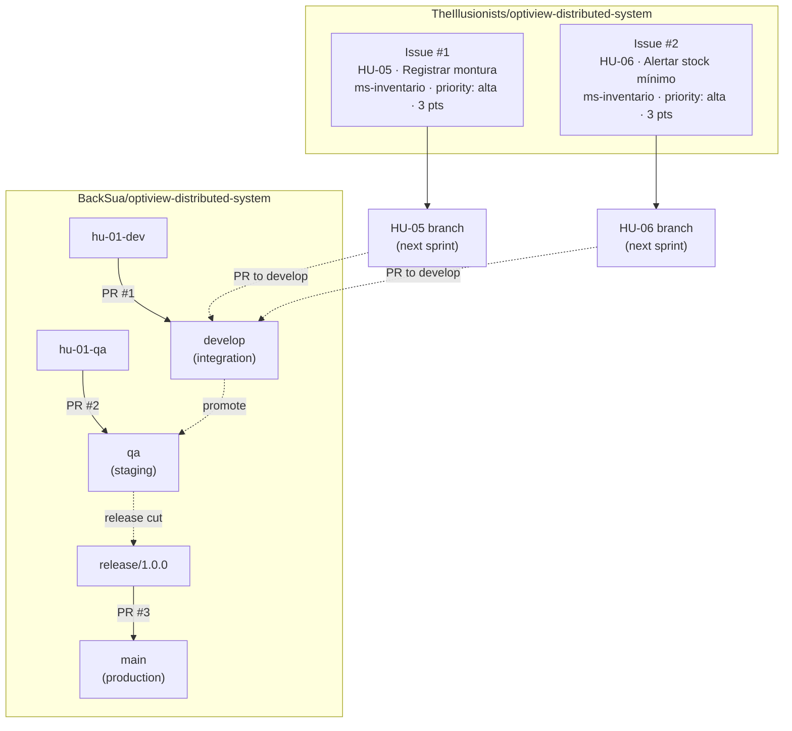

<!-- HU-STATUS TEMPLATE - do NOT remove the <!-- ... --> markers or the table headers.
     Your weekly grade is read AUTOMATICALLY from this file:
       02-week/hu-status/README.md  (inside YOUR fork). English. -->
# Weekly Status - Week 02
<!-- CONFIG-START - must match your profile repo (username/username) CONFIG -->
- FULL_NAME: Bairon Alexander Suarez Camacho
- GITHUB_USER: BackSua
- TEAM: The Illusionists
- SPRINT_GOAL: Bootstrap the OptiView GitFlow repository (main / develop / qa branches + per-HU branches and PRs) and define the ms-inventario backlog items HU-05 and HU-06 as GitHub Issues in the team organisation.
<!-- CONFIG-END -->

## 1. User stories worked this week

| HU ID | Title | Status (todo/doing/done) | Evidence (PR or commit URL) |
|---|---|---|---|
| HU-01 | Registrar paciente — GitFlow branch + PR to develop and qa | done | https://github.com/BackSua/optiview-distributed-system/pull/1 · https://github.com/BackSua/optiview-distributed-system/pull/2 |
| HU-05 | Registrar montura en el inventario | done | https://github.com/TheIllusionists/optiview-distributed-system/issues/1 |
| HU-06 | Alertar sobre stock mínimo de monturas y lentes | done | https://github.com/TheIllusionists/optiview-distributed-system/issues/2 |

## 2. My individual contribution

- Created the **`BackSua/optiview-distributed-system`** repository and established the full GitFlow long-lived branch structure: `main` (default), `develop`, and `qa` — so every environment has its own protected integration line before any feature code is written.
- Created the **per-HU per-environment branches** for HU-01 (`hu-01-dev` and `hu-01-qa`) and the release branch `release/1.0.0`, each with a distinct README commit so the branch is non-empty and a real PR can be opened.
- Opened and documented **3 pull requests** following GitFlow conventions:
  - [PR #1](https://github.com/BackSua/optiview-distributed-system/pull/1): `hu-01-dev` → `develop`
  - [PR #2](https://github.com/BackSua/optiview-distributed-system/pull/2): `hu-01-qa` → `qa`
  - [PR #3](https://github.com/BackSua/optiview-distributed-system/pull/3): `release/1.0.0` → `main`
- Wrote and published **HU-05** ("Registrar montura en el inventario") as a structured GitHub Issue in the team organisation [`TheIllusionists/optiview-distributed-system`](https://github.com/TheIllusionists/optiview-distributed-system/issues/1), including: user story, 5 acceptance criteria (SKU uniqueness, sell-price ≥ buy-price, ACTIVE status on save, optional supplier link), technical notes (endpoint, entity, `stock_movements ENTRY` on initial stock) and labels `ms-inventario · feature · priority: alta`.
- Wrote and published **HU-06** ("Alertar sobre stock mínimo de monturas y lentes") as [Issue #2](https://github.com/TheIllusionists/optiview-distributed-system/issues/2), including: user story, 4 acceptance criteria (dashboard count, visual badge, dedicated endpoint, real-time update on stock movement), and technical notes referencing the partial indexes `idx_frames_stock_low` / `idx_lenses_stock_low` already defined in the DDL.
- Captured full-screen **evidence screenshots** of every step (branches page, all 3 PRs, both issues, issues list) and stored them in `02-week/hu-status/`.

Week 2 workflow diagram — GitFlow branch strategy applied to OptiView:

## 3. Blockers and risks

- The `TheIllusionists/optiview-distributed-system` repository had to be created from scratch (the organisation had no repos). This means the team needs to agree on whether to use this repo or migrate to the personal fork for collaborative work.
- PRs #1–#3 are open but not merged; the team must define branch-protection rules and a review policy before merging to `develop`, `qa`, and `main`.
- Issues HU-05 and HU-06 have no milestone or label objects created yet in the repo (the label text appears in the description body). GitHub labels need to be created (`ms-inventario`, `feature`, `priority: alta`) so they can be assigned properly from the sidebar.

## 4. Plan for next week

- Merge PRs #1–#3 after at least one peer review and add branch-protection rules to `main` and `develop`.
- Create GitHub labels (`ms-inventario`, `ms-pacientes`, `ms-ordenes`, `ms-facturacion`, `feature`, `priority: alta / media / baja`) and assign them to issues HU-05 and HU-06.
- Open `hu-05-dev` branch off `develop`, implement the `RegisterFrameUseCase` domain class (no Spring imports in domain layer) and write unit tests for SKU uniqueness and price validation.
- Define `inventory_schema.frames` and `stock_movements` DDL and write the Flyway migration `V1__create_inventory_schema.sql`.
- Start HU-06 acceptance-criteria implementation: partial-index query for low-stock endpoint and a domain event `StockBelowMinimum`.

## 5. Compliance self-check

- [x] Conventional Commits - `type(scope): summary`
- [x] Per-environment HU branch + PR to that environment (hu-01-dev → develop, hu-01-qa → qa, release/1.0.0 → main)
- [x] Testable acceptance criteria (defined in Issues HU-05 and HU-06 as checkbox lists)
- [ ] Tests added/updated (unit / integration) — no production code written this week; design and repo setup only
- [ ] DDD / hexagonal boundaries respected (domain has no I/O) — pending implementation sprint
- [x] No secrets; config via environment variables

Notes on unchecked items:
- This week's deliverable was repo bootstrapping and backlog definition, not feature code — tests will be added when implementation begins in week 3.
- Hexagonal boundaries will be enforced from the first commit of `hu-05-dev`; the architecture is designed (see HU-05 technical notes) but not yet coded.

## 6. Evidence links

- Repository with GitFlow branches: https://github.com/BackSua/optiview-distributed-system/branches
- PR #1 `hu-01-dev` → `develop`: https://github.com/BackSua/optiview-distributed-system/pull/1
- PR #2 `hu-01-qa` → `qa`: https://github.com/BackSua/optiview-distributed-system/pull/2
- PR #3 `release/1.0.0` → `main`: https://github.com/BackSua/optiview-distributed-system/pull/3
- Issue HU-05 (TheIllusionists org): https://github.com/TheIllusionists/optiview-distributed-system/issues/1
- Issue HU-06 (TheIllusionists org): https://github.com/TheIllusionists/optiview-distributed-system/issues/2
- OptiView user stories source: `C:\Users\bairo\Downloads\OptiView_Historias_Usuario.md`
- Screenshots folder: `02-week/hu-status/` (branches, PRs, issues — 7 PNG files)
