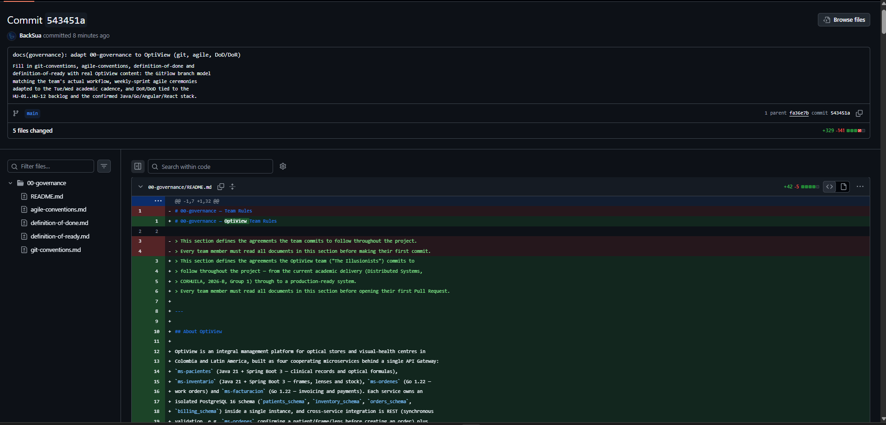

<!-- HU-STATUS TEMPLATE - do NOT remove the <!-- ... --> markers or the table headers.
     Your weekly grade is read AUTOMATICALLY from this file:
       03-week/hu-status/README.md  (inside YOUR fork). English. -->

# Weekly Status - Week 03

<!-- CONFIG-START - must match your profile repo (username/username) CONFIG -->
- FULL_NAME: Bairon Alexander Suarez Camacho
- GITHUB_USER: BackSua
- TEAM: The Illusionists
- SPRINT_GOAL: Clone the team's shared documentation repository `code-corhuila/opti-docs` (single source of truth, direct-to-`main` — no work branches or PRs for docs, per the course's stated workflow) and adapt the entire `00-governance/` section (branch strategy, agile ceremonies, DoR/DoD, documentation rules, per-microservice docs standard, security policy and rules) to OptiView's real stack, backlog and academic cadence.

## 1. User stories worked this week

| HU ID | Title | Status (todo/doing/done) | Evidence (PR or commit URL) |
|---|---|---|---|
| HU-OPT-005 | Clone `code-corhuila/opti-docs` and verify local write access to `main` | done | https://github.com/code-corhuila/opti-docs |
| HU-OPT-006 | Adapt `00-governance/git-conventions.md`, `agile-conventions.md`, `definition-of-done.md`, `definition-of-ready.md` and `README.md` to OptiView and push directly to `main` | done | https://github.com/code-corhuila/opti-docs/commit/e71bf15 |
| HU-OPT-007 | Adapt `00-governance/documentation-rules.md`, `microservices-documentation.md`, `security-policy.md`, `security-rules.md` to OptiView | doing | Adapted locally, pending push by a teammate under their own account directly to `main` (see section 3) |

## 2. My individual contribution

- Initially forked [`code-corhuila/opti-docs`](https://github.com/code-corhuila/opti-docs) into
  a personal fork, but corrected course after re-checking the team's actual instructions: for
  this repo, `code-corhuila/opti-docs` **is itself** OptiView's shared documentation repo (not a
  generic template to fork per student), teammates (`ariel5253`) had already pushed
  project-specific commits directly to its `main` (domain docs, product docs), and the stated
  rule is "single source of truth, everything goes straight to `main`, no work branches or PRs
  here — those apply to the code repos, not this one." Re-pointed the local clone's `upstream`
  remote at `code-corhuila/opti-docs`, verified push access with a dry run, and rebased my local
  governance commit on top of the teammates' newer commits before pushing directly to `main`.
- Read the framework itself before touching any document: the root `README.md`
  ("How to use this framework"), `00-sdd-guide.md` (SDD methodology and weekly fill-in order),
  and the `00-governance/README.md` index, confirming `00-governance` wraps and applies to every
  other section.
- Read each of the 8 template files in `00-governance/` individually to understand what each one
  actually requires (branch strategy, sprint ceremonies, DoR/DoD checklists, documentation
  ownership, per-service doc standard, RBAC model, OWASP-aligned technical controls) before
  writing a single word of OptiView content — no template was filled from its filename alone.
- Gathered real OptiView project context instead of inventing it: the `ms-pacientes` product
  brief (`01-week/hu-status/prd.md`), the GitFlow evidence and HU-05/HU-06 issues from
  `02-week/hu-status/README.md`, the full HU-01…HU-12 backlog (60 story points across
  `ms-pacientes`, `ms-inventario`, `ms-ordenes`, `ms-facturacion`), and the real 5-member
  `TheIllusionists` GitHub organisation roster.
- **Rewrote `git-conventions.md`** around the GitFlow the team is actually running
  (`main ← qa ← develop ← hu-xxx-dev/qa` branches, matching the PRs already opened in Week 2),
  distinguishing the canonical product repo from the personal course-evidence fork, and set
  commit scopes to the real service names.
- **Rewrote `agile-conventions.md`** to replace the textbook Daily Scrum with a Weekly Sync
  anchored on the two real class sessions (Tuesday Planning, Wednesday Review/Retro), keeping
  "1 academic week ≈ 1 Sprint" explicit, and filled the estimation scale, backlog tool and
  team-velocity table with the project's actual numbers instead of bracketed placeholders.
- **Rewrote `definition-of-done.md` and `definition-of-ready.md`** so every checklist item
  references OptiView's real artifacts (hexagonal domain-layer rule from ADR-001, the `qa`
  branch as the academic staging equivalent, HU-05's actual acceptance criteria as a worked
  example) instead of generic bracketed text.
- After an initial pass, corrected the stack across all adapted files once the confirmed
  architecture was clarified: `ms-ordenes` and `ms-facturacion` run on **Go 1.22** (not Java),
  and there are **four** client apps — `portal-admin`/`portal-ventas` (Angular) and
  `portal-paciente`/`dashboard` (React) — not a single Angular portal.
- Verified there were no leftover generic placeholders (`[define]`, `[tool name]`, `[N]`, etc.)
  in any adapted file before treating it as complete, and marked the handful of genuinely
  undecided items (Tech Lead role assignment, Project board URL, secrets-vault choice) with an
  explicit `⚠️ Pendiente de definición por el equipo` instead of inventing an answer.
- Split the 8 adapted `00-governance` files with a teammate for authorship purposes: I pushed
  `README.md`, `git-conventions.md`, `agile-conventions.md`, `definition-of-done.md` and
  `definition-of-ready.md` directly to `code-corhuila/opti-docs` `main` under my own commit;
  `documentation-rules.md`, `microservices-documentation.md`, `security-policy.md` and
  `security-rules.md` were adapted and handed off for a teammate to push under theirs, to the
  same repo.

## 3. Blockers and risks

- `documentation-rules.md`, `microservices-documentation.md`, `security-policy.md` and
  `security-rules.md` are fully adapted but intentionally **not yet pushed** to
  `code-corhuila/opti-docs` — they are being handed to a teammate to commit under their own
  GitHub account so individual authorship is preserved across the team. HU-OPT-007 stays `doing`
  until that push lands.
- Almost pushed the adapted governance docs to a personal fork instead of the shared
  `code-corhuila/opti-docs` repo — caught before it caused a real divergence, but it cost a
  rebase to reconcile with two teammates' commits that had landed on `main` in the meantime.
  Worth re-reading the course's per-repo workflow rules before assuming "fork it" applies
  everywhere; it does for the code repos, not for this shared docs repo.
- The GitHub CLI (`gh`) is not installed in the working environment and no GitHub token was
  configured, so write access to `code-corhuila/opti-docs` had to be verified interactively
  (browser login, then a `git push --dry-run`) rather than scripted — worth automating with `gh`
  before the next docs-heavy week.
- Several governance decisions are explicitly still open and marked `⚠️ Pendiente de definición
  por el equipo` rather than guessed: who holds the Tech Lead/PO role, the GitHub Projects board
  URL, the team chat channel, and the secrets-management tool for anything beyond local
  `docker-compose`. These need to be closed in an upcoming Tuesday Planning.

## 4. Plan for next week

- Confirm the teammate's push of the remaining 4 `00-governance` files and verify the full
  section is consistent (no stack contradictions, no stray placeholders) once merged.
- Create the GitHub Projects board referenced (but not yet created) in `agile-conventions.md`,
  with the `Story points` and `Microservicio` custom fields.
- Move on to `01-context/` and `02-domain/` per the SDD fill-in order in `00-sdd-guide.md`,
  reusing the bounded-context work already drafted in Week 1.
- Close the open questions listed in section 3 during Tuesday's Sprint Planning and update the
  `⚠️ Pendiente` markers in `00-governance/` with the team's actual decisions.

## 5. Compliance self-check

- [x] Conventional Commits - `type(scope): summary`
- [ ] Per-environment HU branch + PR to that environment (hu-xxx-dev -> develop, ...)
- [x] Testable acceptance criteria (governance docs were validated against the DoR/DoD checklist they themselves define)
- [ ] Tests added/updated (unit / integration) — documentation-only week, no service code changed
- [ ] DDD / hexagonal boundaries respected (domain has no I/O) — not applicable this week
- [x] No secrets; config via environment variables

Notes on unchecked items:
- Work landed directly on `main` in `opti-docs` (documentation scaffold setup), not through a
  per-environment HU branch — `opti-docs` does not run the product's `develop`/`qa`/`main`
  GitFlow, since it is documentation, not a deployable service.
- No test suite applies to Markdown governance documents; correctness was instead verified by
  re-reading each file against its own DoR/DoD checklist and grepping for leftover generic
  template placeholders.

## 6. Evidence links

- Shared team documentation repo: https://github.com/code-corhuila/opti-docs
- Commit — adapted git/agile/DoD/DoR governance docs, pushed directly to `main`: https://github.com/code-corhuila/opti-docs/commit/e71bf15
- OptiView user stories source (HU-01 to HU-12): `02-week/hu-status/README.md` and `C:\Users\bairo\Downloads\OptiView_Historias_Usuario.md`
- Screenshot evidence of the earlier pushed commit on GitHub (fork stage, before re-pointing to `code-corhuila/opti-docs`):

