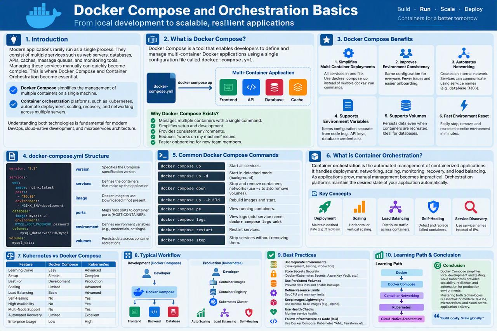
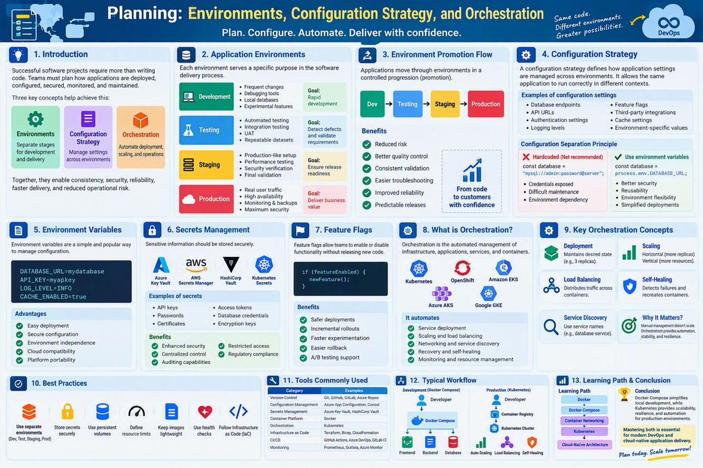

<!-- HU-STATUS TEMPLATE - do NOT remove the <!-- ... --> markers or the table headers.
     Your weekly grade is read AUTOMATICALLY from this file:
       06-week/hu-status/README.md  (inside YOUR fork). English. -->

# Weekly Status - Week 06

<!-- CONFIG-START - must match your profile repo (username/username) CONFIG -->
- FULL_NAME: Bairon Alexander Suarez Camacho
- GITHUB_USER: BackSua
- TEAM: The Illusionists
- SPRINT_GOAL: Master Docker Compose fundamentals and the environment/configuration-strategy planning that OptiView needs before writing its own `docker-compose.yml` for the 6 backend services (api-gateway, auth-service, ms-pacientes, ms-inventario, ms-ordenes, ms-facturacion) and the 4 client apps.

## 1. User stories worked this week

| HU ID | Title | Status (todo/doing/done) | Evidence (PR or commit URL) |
|---|---|---|---|
| N/A | Conceptual/self-study week — no new HU-OPT story opened | done | See sections 2 and 6 |

## 2. My individual contribution

- Studied the session material on Docker Compose and container orchestration: multi-container
  definition via `docker-compose.yml`, service networking (containers addressing each other by
  service name instead of IP), environment variables, named volumes, health checks, and the
  Docker Compose vs. Kubernetes trade-off (development vs. production).
- Studied the planning session on environments, configuration strategy, and orchestration: the
  Dev → Testing → Staging → Production promotion flow, the configuration-separation principle
  (never hardcode credentials/URLs — read them from the environment), secrets management options
  (Docker Secrets, cloud secret managers), and feature flags as a way to decouple deploy from
  release.
- Wrote a one-page reference summary and a companion infographic for each of the two topics
  (`docker-compose-orchestration-basics.md` / `planning-environments-config-orchestration.md`
  and their matching `.jpeg` files in this folder), to have a consolidated reference before
  applying these concepts to OptiView's actual infrastructure.
- Mapped the concepts explicitly onto OptiView's real situation, confirmed earlier this session
  while working on `opti-docs`: the product repository
  (`TheIllusionists/optiview-distributed-system`) is still just a README — there is no
  `docker-compose.yml` for OptiView yet, and `10-devops/local-setup.md` in `opti-docs` is still
  the generic scaffold template, not filled in for our 6 services. This week's study is the
  preparation for that gap, not the fix for it yet.

## 3. Blockers and risks

- OptiView does not have a real `docker-compose.yml` to practice against yet, since the product
  repository has no service code. This week's work stayed conceptual (Docker Compose applied to
  generic examples) rather than applied directly to our own services.
- `10-devops/local-setup.md` and `10-devops/environments.md` in `opti-docs` are still the
  generic framework scaffold (confirmed while auditing the repo this session) — they need real
  OptiView environment names, ports, and secrets strategy once the services exist to configure.

## 4. Plan for next week

- Apply this week's concepts to draft a first real `docker-compose.yml` for OptiView once
  service scaffolding exists, following the DB-per-service pattern already confirmed for the
  project.
- Continue into Week 07's inter-service communication topic, which determines how the 6
  services in this week's topology actually talk to each other.

## 5. Compliance self-check

- [ ] Conventional Commits - `type(scope): summary`
- [ ] Per-environment HU branch + PR to that environment (hu-xxx-dev -> develop, ...)
- [ ] Testable acceptance criteria
- [ ] Tests added/updated (unit / integration)
- [ ] DDD / hexagonal boundaries respected (domain has no I/O)
- [x] No secrets; config via environment variables

Notes on unchecked items:
- This was a conceptual/self-study week (no code, no HU branch, no tests) — the checklist items
  above about branches, acceptance criteria, and tests do not apply to a study deliverable.

## 6. Evidence links

- Session summary: [`docker-compose-orchestration-basics.md`](./docker-compose-orchestration-basics.md)
- Session summary: [`planning-environments-config-orchestration.md`](./planning-environments-config-orchestration.md)
- Infographic: 
- Infographic: 
