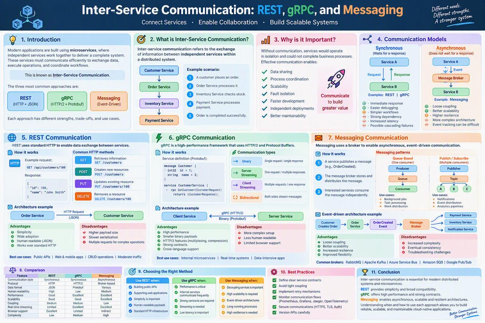
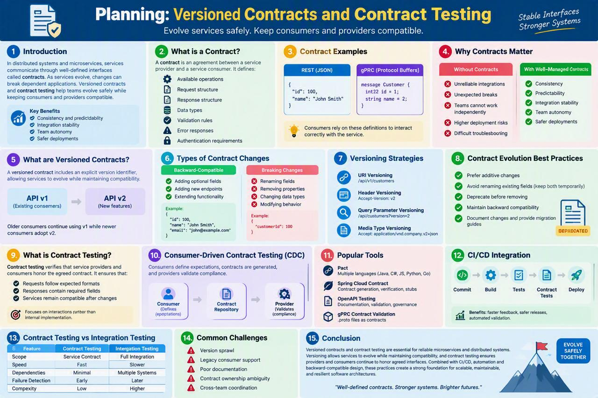

<!-- HU-STATUS TEMPLATE - do NOT remove the <!-- ... --> markers or the table headers.
     Your weekly grade is read AUTOMATICALLY from this file:
       07-week/hu-status/README.md  (inside YOUR fork). English. -->

# Weekly Status - Week 07

<!-- CONFIG-START - must match your profile repo (username/username) CONFIG -->
- FULL_NAME: Bairon Alexander Suarez Camacho
- GITHUB_USER: BackSua
- TEAM: The Illusionists
- SPRINT_GOAL: Study REST/gRPC/messaging trade-offs and contract versioning/testing, to inform how OptiView's api-gateway and its 5 internal services should communicate and how `07-api/contracts/openapi/` should evolve without breaking consumers.

## 1. User stories worked this week

| HU ID | Title | Status (todo/doing/done) | Evidence (PR or commit URL) |
|---|---|---|---|
| N/A | Conceptual/self-study week — no new HU-OPT story opened | done | See sections 2 and 6 |

## 2. My individual contribution

- Studied inter-service communication models: synchronous REST (simple, human-readable, higher
  latency), gRPC (HTTP/2 + Protobuf, high performance, stricter contracts), and asynchronous
  messaging (event-driven via a broker, loose coupling, eventual consistency) — including when
  each one fits, using the comparison table (coupling, scalability, browser support, complexity)
  from the session material.
- Studied the planning session on versioned contracts and contract testing: what a contract is
  (operations, request/response shape, validation rules), the difference between
  backward-compatible changes (additive fields, new endpoints) and breaking changes (renaming or
  removing fields), the four versioning strategies (URI, header, query parameter, media type),
  and consumer-driven contract testing (Pact-style: consumer defines expectations, provider
  validates compliance).
- Wrote a one-page reference summary and a companion infographic for each topic
  (`inter-service-communication-rest-grpc-messaging.md` /
  `planning-versioned-contracts-contract-testing.md` and their matching `.jpeg` files in this
  folder).
- Connected both topics to OptiView's actual state: the real `07-api/contracts/openapi/`
  contracts already merged for `api-gateway` and `ms-pacientes` (PR #10 in `opti-docs`) are REST
  + OpenAPI, matching this week's "use REST when building public APIs, simplicity matters,
  human-readable payloads" guidance — and are still unversioned (no `/v1/` prefix, no header
  versioning), which is a concrete gap this week's contract-versioning material points at
  directly for the remaining 4 services' contracts.

## 3. Blockers and risks

- OptiView's existing OpenAPI contracts (`api-gateway`, `ms-pacientes`) do not yet apply any of
  this week's versioning strategies — there is no `/v1/` prefix or `Accept-Version` header. Not
  fixing this now since it touches an already-merged contract file outside this week's scope,
  but flagging it here so it is not lost.
- No message broker technology has been chosen yet for OptiView (confirmed while working on the
  Week 8 diagrams: `c4-topologia-docker.mmd` labels it "Kafka/RabbitMQ — to be defined"), so the
  messaging half of this week's material stays conceptual until that decision is made.

## 4. Plan for next week

- Bring the contract-versioning question above to the team so `07-api/contracts/openapi/`
  adopts a single strategy before more services add their own contracts.
- Continue into Week 08's Agile & DevOps material, and into the diagrams deliverable that
  depends on this week's inter-service-communication concepts (the request-path and topology
  diagrams).

## 5. Compliance self-check

- [ ] Conventional Commits - `type(scope): summary`
- [ ] Per-environment HU branch + PR to that environment (hu-xxx-dev -> develop, ...)
- [ ] Testable acceptance criteria
- [ ] Tests added/updated (unit / integration)
- [ ] DDD / hexagonal boundaries respected (domain has no I/O)
- [x] No secrets; config via environment variables

Notes on unchecked items:
- This was a conceptual/self-study week (no code, no HU branch, no tests) — the checklist items
  above about branches, acceptance criteria, and tests do not apply to a study deliverable.

## 6. Evidence links

- Session summary: [`inter-service-communication-rest-grpc-messaging.md`](./inter-service-communication-rest-grpc-messaging.md)
- Session summary: [`planning-versioned-contracts-contract-testing.md`](./planning-versioned-contracts-contract-testing.md)
- Infographic: 
- Infographic: 
- Related real artifact referenced above: [`07-api/contracts/openapi/`](https://github.com/code-corhuila/opti-docs/tree/main/07-api/contracts/openapi) (PR [#10](https://github.com/code-corhuila/opti-docs/pull/10))
