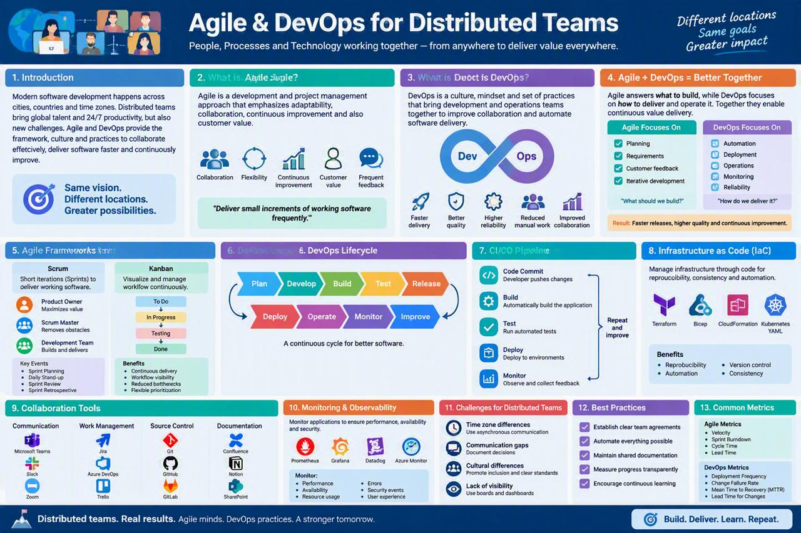
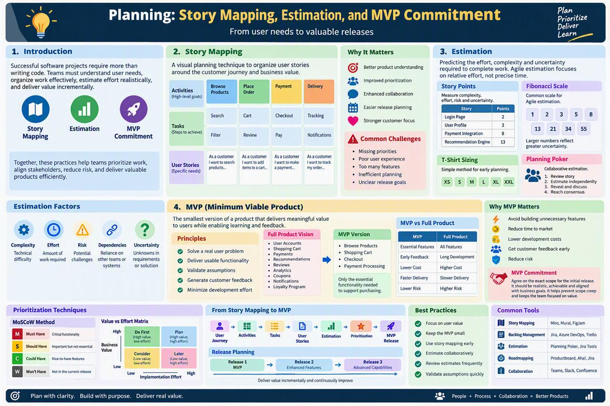

<!-- HU-STATUS TEMPLATE - do NOT remove the <!-- ... --> markers or the table headers.
     Your weekly grade is read AUTOMATICALLY from this file:
       08-week/hu-status/README.md  (inside YOUR fork). English. -->

# Weekly Status - Week 08

<!-- CONFIG-START - must match your profile repo (username/username) CONFIG -->
- FULL_NAME: Bairon Alexander Suarez Camacho
- GITHUB_USER: BackSua
- TEAM: The Illusionists
- SPRINT_GOAL: Apply Agile/DevOps distributed-team practices to actually split and deliver the Week 8 diagrams assignment with a teammate (parallel branches, individual-authorship PRs, PR-gated review), and study story mapping / estimation / MVP commitment ahead of Sprint planning.

## 1. User stories worked this week

| HU ID | Title | Status (todo/doing/done) | Evidence (PR or commit URL) |
|---|---|---|---|
| N/A | Week 8 diagrams deliverable — 5 of 9 reference diagrams ported to OptiView's real architecture | done | [`opti-docs` PR #13](https://github.com/code-corhuila/opti-docs/pull/13) |

## 2. My individual contribution

- Studied the Agile & DevOps for distributed teams session (Scrum/Kanban framing, the
  Plan→Develop→Build→Test→Release DevOps lifecycle, CI/CD pipeline stages, collaboration-tool
  categories) and the planning session on story mapping, estimation, and MVP commitment
  (activities → tasks → user stories grid, Fibonacci story points, MoSCoW prioritization,
  MVP-vs-full-product trade-offs). Summaries and infographics for both are in this folder.
- Applied the distributed-team practice directly instead of just studying it: split the Week 8
  diagrams assignment with a teammate (Juan Diego) using individual-authorship PRs instead of one
  person doing everything — the same principle from this week's material ("establish clear team
  agreements", "automate everything possible").
- Adapted 5 of the 9 reference diagrams from the instructor's `simple-stock-flow` example
  (`08-week/02-session/diagramas/` in this repo) to OptiView's real, confirmed architecture (6
  backend services, DB per service, 4 client apps): Docker network topology, healthcheck-driven
  startup order, the request-path sequence for `GET /patients/{id}/formulas/current` (with its
  401/403/404 branches), the `ms-pacientes` data model, and the "register optical formula"
  sequence — the last one grounded directly in the real, already-merged
  `07-api/contracts/openapi/ms-pacientes.yaml` contract and its `INV-PAT-003` invariant, not
  invented from scratch.
- Wrote every diagram as a Mermaid source file (`08-diagrams/diagrams/source/*.mmd`), validated
  each one by rendering it, and registered all 9 (mine and the teammate's) in
  `08-diagrams/diagram-index.md` with clear per-row authorship.
- Responded in writing to the automated course review left on the PR: translated the 5 diagrams
  to English per `ADR-001-idioma-documentacion.md` (kept literal OpenAPI enum values verbatim),
  removed registry rows that pointed at not-yet-merged files from the teammate's own PR, fixed a
  self-contradiction between the PR description and the registry, and left a written, reasoned
  note (not a silent fix) on why the `ms-` service-naming convention was kept instead of renamed,
  since it already exists in the merged contract file.

## 3. Blockers and risks

- The product repository (`TheIllusionists/optiview-distributed-system`) is still just a README
  with no service code, so two of the 9 reference diagrams (workspace tree, repository internal
  structure) describe the *planned* structure, not a screenshot of real code — flagged as such in
  the diagrams themselves rather than presented as already built.
- No message broker technology is chosen yet for OptiView, so the topology diagram labels it "to
  be defined" rather than naming a specific product.
- `main` in `opti-docs` requires 1 approval from the course reviewer (CODEOWNERS + branching
  policy) before any PR merges — PR #13 is open and awaiting that review as of this entry.

## 4. Plan for next week

- Get PR #13 approved and merged once the course review re-runs on the latest commits.
- Confirm the teammate's remaining 4 diagrams (workspace tree, repo structure, double hexagon,
  dependency rule) land and get their `diagram-index.md` rows added.
- Move the story-mapping/MVP-commitment concepts from this week into the next real Sprint
  Planning session, applied to the actual OptiView backlog.

## 5. Compliance self-check

- [x] Conventional Commits - `type(scope): summary`
- [ ] Per-environment HU branch + PR to that environment (hu-xxx-dev -> develop, ...)
- [x] Testable acceptance criteria (each diagram cites the real doc/contract it must match)
- [ ] Tests added/updated (unit / integration)
- [ ] DDD / hexagonal boundaries respected (domain has no I/O)
- [x] No secrets; config via environment variables

Notes on unchecked items:
- Work landed on a `docs/` branch in `opti-docs` with a PR gated by the course's own
  branching policy (1 approval + CODEOWNERS), not the `hu-xxx-dev`/`hu-xxx-qa` GitFlow — that
  flow applies to the product repository, not to documentation, per `git-conventions.md`.
- No test suite applies to Mermaid diagram source files; each one was instead validated by
  rendering it and cross-checking its content against the real contract/doc it cites as source.

## 6. Evidence links

- Session summary: [`agile-devops-distributed-teams.md`](./agile-devops-distributed-teams.md)
- Session summary: [`planning-story-mapping-estimation-mvp-commitment.md`](./planning-story-mapping-estimation-mvp-commitment.md)
- Infographic: 
- Infographic: 
- Diagrams PR (my 5 of 9): [`opti-docs` PR #13](https://github.com/code-corhuila/opti-docs/pull/13)
- Teammate's diagrams PR (merged): [`opti-docs` PR #12](https://github.com/code-corhuila/opti-docs/pull/12)
- Diagram registry: [`08-diagrams/diagram-index.md`](https://github.com/code-corhuila/opti-docs/blob/main/08-diagrams/diagram-index.md)
