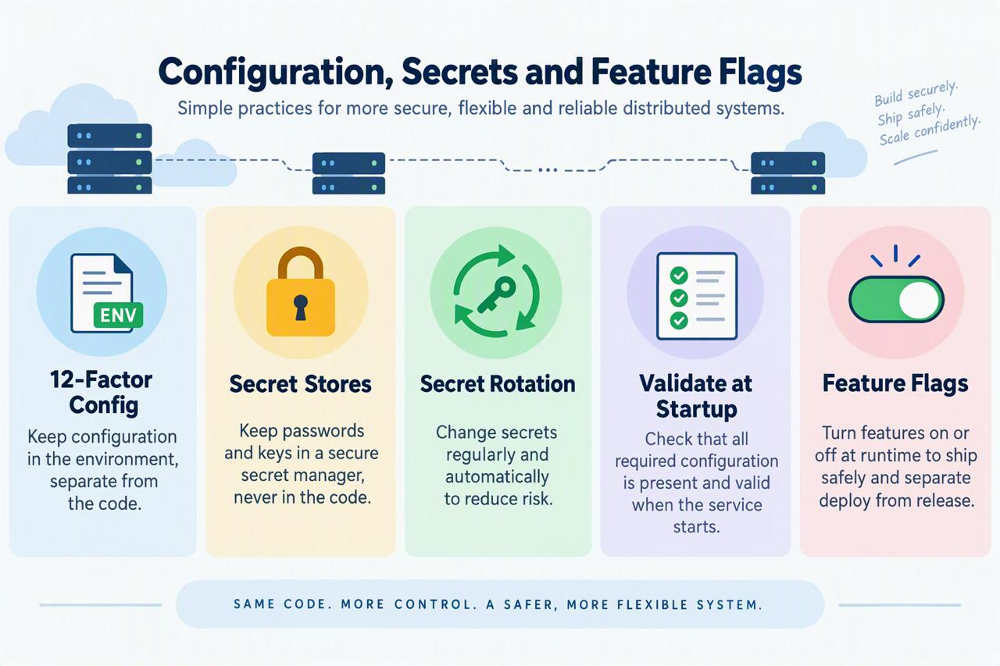
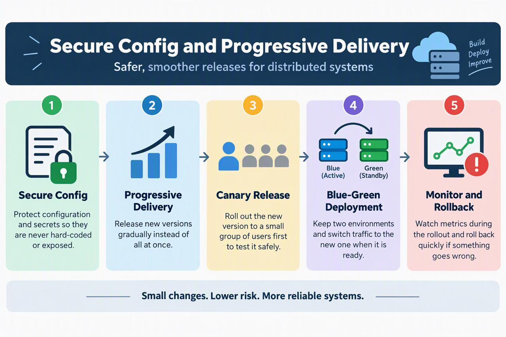

<!-- HU-STATUS TEMPLATE - do NOT remove the <!-- ... --> markers or the table headers.
     Your weekly grade is read AUTOMATICALLY from this file:
       09-week/hu-status/README.md  (inside YOUR fork). English. -->

# Weekly Status - Week 09

<!-- CONFIG-START - must match your profile repo (username/username) CONFIG -->
- FULL_NAME: Bairon Alexander Suarez Camacho
- GITHUB_USER: BackSua
- TEAM: The Illusionists
- SPRINT_GOAL: Study secure configuration, secrets management, feature flags and progressive delivery, and apply the documentation-consistency side of it to the OptiView docs repository (API contracts, environments, deployment).
<!-- CONFIG-END -->

## 1. User stories worked this week
| HU ID | Title | Status (todo/doing/done) | Evidence (PR or commit URL) |
|---|---|---|---|
| N/A | Documentation audit of `opti-docs` against the course Project Tracker (stack consistency, English-only docs, service/repository mapping, deployment and data-dictionary docs) | done | [`opti-docs` PR #19](https://github.com/code-corhuila/opti-docs/pull/19) |

## 2. My individual contribution

- Studied the Week 9 material: 12-Factor configuration, secret stores and rotation, startup
  configuration validation, feature flags, and progressive delivery (canary, blue-green,
  monitor-and-rollback). Summaries and infographics are in this folder.
- Ran a full audit of the `opti-docs` repository and opened PR #19 with the fixes: corrected the
  inverted Java/Go stack tables to match ADR-002, translated remaining Spanish documents to
  English per ADR-001, archived the superseded `02-domain/optiview/` tree, and added the missing
  `product-backlog.md`, `deployment.md` and `data-dictionary.md` with real content.
- Tied the study topics to the project docs: `10-devops/environments.md` no longer claims
  Kubernetes-style rollbacks and now marks the rollout strategy (canary / blue-green / recreate) as
  a pending team decision, and `05-architecture/deployment.md` documents the Docker Compose
  rollback path actually used in Cut 1.
- The corrected `07-api` OpenAPI contracts (integer-cent money fields, `Idempotency-Key`,
  `/lenses` and `/daily-closings` resources, gateway routes) were handed to the teammate to land in
  a separate PR, so each of us has our own PR.

## 3. Blockers and risks

- PR #19 needs 1 approval from the course reviewer (CODEOWNERS) before it can merge to `main`; it
  is open and awaiting review.
- No rollout strategy or secret-store technology is decided yet for OptiView; both are recorded as
  pending team decisions rather than invented.
- `05-release/optiview-platform-v1.0.0/` holds real monolith code inside the docs repository; where
  it should live is still undecided.

## 4. Plan for next week

- Get PR #19 reviewed and merged, and confirm the teammate's `07-api` PR is opened separately.
- Decide and document the rollout strategy and where secrets will live (ADR candidates).
- Move on to the persistence topics (Saga, Outbox, CQRS) in Week 10.

## 5. Compliance self-check
- [x] Conventional Commits - `type(scope): summary`
- [ ] Per-environment HU branch + PR to that environment (hu-xxx-dev -> develop, ...)
- [x] Testable acceptance criteria
- [ ] Tests added/updated (unit / integration)
- [ ] DDD / hexagonal boundaries respected (domain has no I/O)
- [x] No secrets; config via environment variables

Notes on unchecked items:
- The work is documentation, delivered on a `docs/` branch with a PR gated by the course branching
  policy (1 approval + CODEOWNERS), not the `hu-xxx-dev` flow, which applies to the product repo.
- No test suite applies to Markdown/OpenAPI documents; YAML contracts were instead parsed to check
  they are valid.

## 6. Evidence links

- Session summary: [`configuration-secrets-feature-flags.md`](./configuration-secrets-feature-flags.md)
- Session summary: [`planning-secure-configuration-progressive-delivery.md`](./planning-secure-configuration-progressive-delivery.md)
- Infographic: 
- Infographic: 
- Documentation audit PR: [`opti-docs` PR #19](https://github.com/code-corhuila/opti-docs/pull/19)
