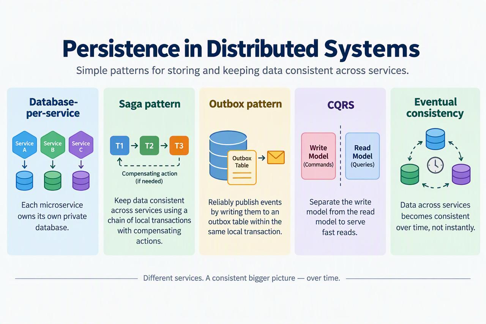
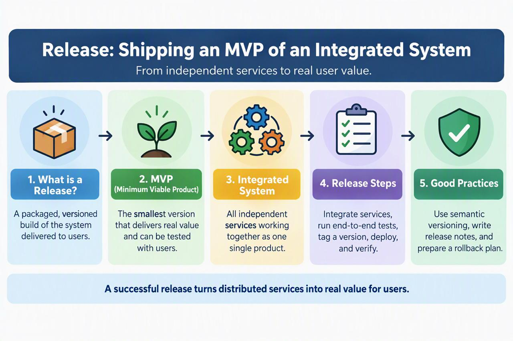

<!-- HU-STATUS TEMPLATE - do NOT remove the <!-- ... --> markers or the table headers.
     Your weekly grade is read AUTOMATICALLY from this file:
       10-week/hu-status/README.md  (inside YOUR fork). English. -->

# Weekly Status - Week 10

<!-- CONFIG-START - must match your profile repo (username/username) CONFIG -->
- FULL_NAME: Bairon Alexander Suarez Camacho
- GITHUB_USER: BackSua
- TEAM: The Illusionists
- SPRINT_GOAL: Understand persistence patterns for distributed systems (database-per-service, Saga, Outbox, CQRS, eventual consistency) and the release process for shipping MVP 2 as one integrated system.
<!-- CONFIG-END -->

## 1. User stories worked this week
| HU ID | Title | Status (todo/doing/done) | Evidence (PR or commit URL) |
|---|---|---|---|
| HU-14 | Dashboard redesign with real metrics, charts and quick links | done | [`opti-front@aebea7b`](https://github.com/code-corhuila/opti-front/commit/aebea7b6a) |
| HU-17 | Patients summary endpoint and summary cards with Avatar | done | [`opti-customers-api@bf7e39f`](https://github.com/code-corhuila/opti-customers-api/commit/bf7e39f61), [`opti-customers-portal@aa85a71`](https://github.com/code-corhuila/opti-customers-portal/commit/aa85a7179), [`opti-front@9c01b49`](https://github.com/code-corhuila/opti-front/commit/9c01b4999) |
| HU-18 | Patient form grouped into sections | done | [`opti-customers-portal@4a0a39e`](https://github.com/code-corhuila/opti-customers-portal/commit/4a0a39e1b) |
| HU-21 | Work order list and detail redesign | done | [`opti-sales-portal@a1fcd38`](https://github.com/code-corhuila/opti-sales-portal/commit/a1fcd388f) |
| HU-22 | New-sale form converted into a 4-step wizard | done | [`opti-sales-portal@7d9aac9`](https://github.com/code-corhuila/opti-sales-portal/commit/7d9aac94a) |
| HU-23 | Optometria page listing patients needing formula attention, plus nav entry | done | [`opti-customers-portal@1ee7dc4`](https://github.com/code-corhuila/opti-customers-portal/commit/1ee7dc413), [`opti-front@96e8f73`](https://github.com/code-corhuila/opti-front/commit/96e8f7329) |
| HU-24 | Sales reports: timeseries and orders-by-status endpoints, Reportes section, nav entry | done | [`opti-sales-api@63926c8`](https://github.com/code-corhuila/opti-sales-api/commit/63926c8a9), [`opti-sales-portal@e87ea6c`](https://github.com/code-corhuila/opti-sales-portal/commit/e87ea6ca8), [`opti-front@e51c40a`](https://github.com/code-corhuila/opti-front/commit/e51c40a8e) |
| HU-25 | Accessory and Liquid catalogues (DB tables, API, portal) | done | [`opti-products-db@5806dc0`](https://github.com/code-corhuila/opti-products-db/commit/5806dc0d5), [`opti-products-api@75aab1e`](https://github.com/code-corhuila/opti-products-api/commit/75aab1edd), [`opti-products-portal@a6c6589`](https://github.com/code-corhuila/opti-products-portal/commit/a6c65892c) |
| N/A | Frame photo upload and lens catalogue with stock control and reserve/release | done | [`opti-products-api@217d823`](https://github.com/code-corhuila/opti-products-api/commit/217d823bc), [`opti-products-api@829b0cf`](https://github.com/code-corhuila/opti-products-api/commit/829b0cff4), [`opti-products-api@f7082b6`](https://github.com/code-corhuila/opti-products-api/commit/f7082b677) |
| N/A | Electronic payment authorization through a gateway | done | [`opti-sales-api@38c3aa1`](https://github.com/code-corhuila/opti-sales-api/commit/38c3aa138) |
| N/A | Study deliverables: persistence patterns (Session 1) and release / MVP 2 (Session 2) | done | See section 6 |

## 2. My individual contribution

- Delivered the MVP 2 feature set across the OptiView repositories: dashboard, patients summary,
  optometry page, sales wizard and work-order redesign, sales reports, accessory/liquid and lens
  catalogues, frame photos, and electronic payment authorization (see the table above). Also
  published Docker images to GHCR from CI and made the gateway and shell proxies configurable for
  deployment.
- Studied persistence in distributed systems: database-per-service, the Saga pattern with
  compensating actions, the Outbox pattern for reliable event publishing, CQRS, and eventual
  consistency. Summary and infographic are in this folder.
- Studied the release session: what a release is, MVP scope, integrated-system delivery, release
  steps (integrate, end-to-end tests, tag, deploy, verify) and good practices (semantic versioning,
  release notes, rollback plan). Summary and infographic are in this folder.
- Relevance to OptiView: the architecture already follows database-per-service (one schema per
  service, no cross-schema foreign keys, per ADR-002); the work-order approval flow
  (`ms-ordenes` -> `ms-inventario` stock decrement -> `OrdenCreada` event -> `ms-facturacion`) is
  the natural candidate for a Saga plus Outbox once a message broker is chosen.

## 3. Blockers and risks

- No message broker technology is chosen yet, so Outbox delivery and Saga orchestration remain
  design-level only for OptiView.
- Cut 1 runs as a monolith, so cross-service consistency is not exercised until the services are
  split.

## 4. Plan for next week

- Decide the message broker and record it as an ADR.
- Evaluate Saga (orchestration vs. choreography) for the work-order approval flow.
- Prepare the MVP 2 release: version tag, release notes and a rollback plan.

## 5. Compliance self-check
- [x] Conventional Commits - `type(scope): summary`
- [ ] Per-environment HU branch + PR to that environment (hu-xxx-dev -> develop, ...)
- [x] Testable acceptance criteria
- [x] Tests added/updated (unit / integration)
- [ ] DDD / hexagonal boundaries respected (domain has no I/O)
- [x] No secrets; config via environment variables

Notes on unchecked items:
- Study documents have no HU branch or tests; the feature work above lives in the code repositories.

## 6. Evidence links

- Feature commits: see the table in section 1 (repositories under `code-corhuila`).
- Session summary: [`persistence-saga-outbox-cqrs.md`](./persistence-saga-outbox-cqrs.md)
- Session summary: [`release-shipping-mvp2.md`](./release-shipping-mvp2.md)
- Infographic: 
- Infographic: 
